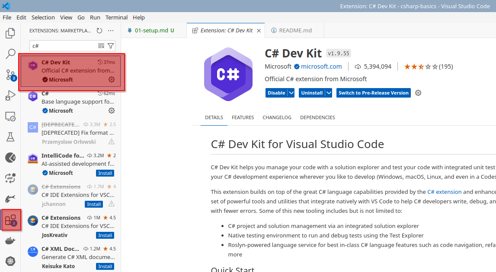

# 1. Tools, Setup & .NET
## Agenda   
* Introduction to C# & the .NET runtime (slides)
* Git & why version management is crucial (slides)
* Visual Studio & the role of the IDE (discussion)
* MSBuild & how to build softwares (task)
* Hello World! (task)

---
# 1. Tools, Setup & .NET
## .Net

* Free == free available
* Open source == you can get source code and participate on development
* Cross-platform == works on Linux, MacOS, Windows
* Development platform 
    * runtime for programming languages **C#** and F#
    * libraries and development tools for application development

---
# 1. Tools, Setup & .NET
## .Net != .Net Framework

|.Net|.Net Framework|
|---|---|
|runs on Linux, MacOS, Windows|only runs on Windows|
| has to be installed | included in Windows |
|**recommanded for new development** |

> https://learn.microsoft.com/de-de/shows/dotnet-for-beginners/what-is-dotnet-dotnet-for-beginners

---
# 1. Tools, Setup & .NET
## What can you do with .Net?

* you can run and develop:
  * Web applications
  * Mobile and desktop applications
  * Cloud-native apps

---
# 1. Tools, Setup & .NET
## C#

* Developed in 2002 by Anders Hejlsberg on behalf of Microsoft as part of the .NET strategy
* platform-independent
* object-oriented

---
# 1. Tools, Setup & .NET

## Tools
* Visual Studio
* Visual Studio Code

## Links
* https://learn.microsoft.com/de-de/shows/dotnet-for-beginners/what-is-dotnet-dotnet-for-beginners
* https://de.wikipedia.org/wiki/.NET_(Plattform)#Programmiersprachen

---
# 1. Tools, Setup & .NET
## Visual Studio Code

add extension

---
# 1. Tools, Setup & .NET

create new project

---
# Git

* in order to work together, you need to handle parallel changes of your team
* Git is a version control system designed to do this
* you work with branches e.g. to separate different features from each other
* important commands:
  * `git clone https://...` clones a project from a git repository to your lokal file system
  * `git add .` adds your changes to a stage
  * `git commit .` commits your changes in your local branch
  * `git push` pushes your changes to remote branch
  * `git pull` get the latest changes from your repository
