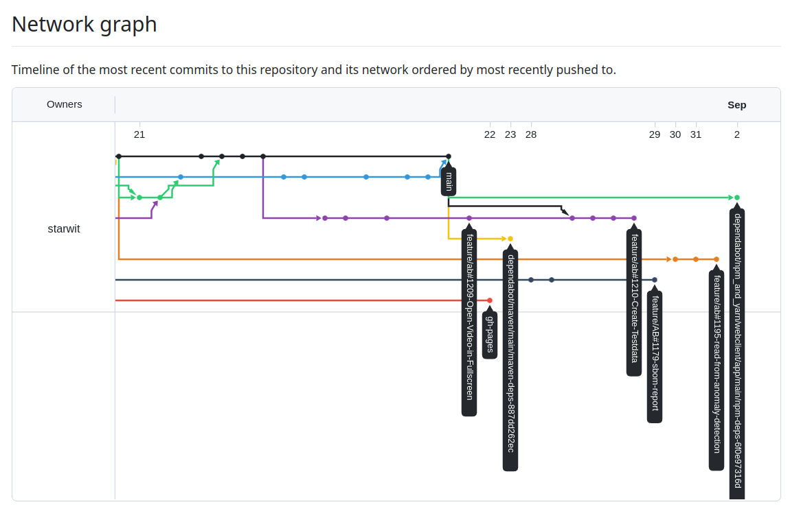
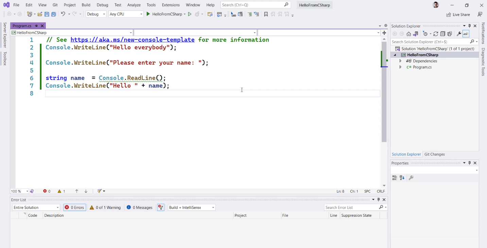
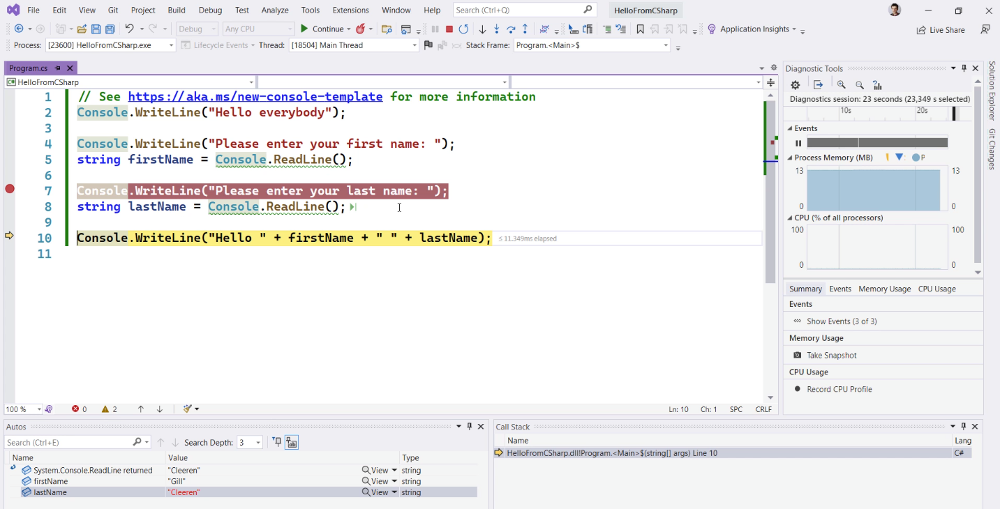

<!-- _class: lead -->
## 1. Tools, Setup & .NET

---
# Agenda   
* Introduction to C# & the .NET runtime
* Git & why version management is crucial
* Visual Studio & the role of the IDE
* MSBuild & how to build softwares
* Task: Hello World!

---
# 1. Introduction to C# and the .NET runtime

## .Net

* Free == free available
* Open source == you can get source code and participate on development
* Cross-platform == works on Linux, MacOS, Windows
* Development platform 
    * runtime for programming languages **C#** and F#
    * libraries and development tools for application development

---
# 1. Introduction to C# and the .NET runtime

## .Net != .Net Framework

|.Net|.Net Framework|
|---|---|
|runs on Linux, MacOS, Windows|only runs on Windows|
| has to be installed | included in Windows |
|**recommanded for new development** |

> https://learn.microsoft.com/de-de/shows/dotnet-for-beginners/what-is-dotnet-dotnet-for-beginners

---
# 1. Introduction to C# and the .NET runtime
## What can you do with .Net?

* you can run and develop:
  * Web applications
  * Mobile and desktop applications
  * Cloud-native apps
* includes a compiler for C# and F#. A compiler translates the program to something the computer (operating system) can understand

---
# 1. Introduction to C# and the .NET runtime
## C#

* Developed in 2002 by Anders Hejlsberg on behalf of Microsoft as part of the .NET strategy
* platform-independent
* object-oriented
* type-safe

---
# 1. Introduction to C# and the .NET runtime

## Tools
* Visual Studio
* Visual Studio Code

## Links
* [Introduction videos](https://learn.microsoft.com/de-de/shows/dotnet-for-beginners/what-is-dotnet-dotnet-for-beginners)
* [Wikipedia](https://de.wikipedia.org/wiki/.NET_(Plattform)#Programmiersprachen)
* [Microsoft Training](https://learn.microsoft.com/de-de/training/modules/dotnet-introduction/?source=recommendations)
* [Knowledge Check](https://learn.microsoft.com/de-de/training/modules/dotnet-introduction/6-knowledge-check)

---
# 2. Git and why version management is crucial
## Git Overview

* in order to work together, you need to handle parallel changes of your team
* Git is a version control system designed to do this
* you work with branches e.g. to separate different features from each other
* important commands:
  * `git clone https://...` clones a project from a git repository to your lokal file system
  * `git add .` adds your changes to a stage
  * `git commit .` commits your changes in your local branch
  * `git push` pushes your changes to remote branch
  * `git pull` get the latest changes from your repository

---
# 2. Git and why version management is crucial
## Git Branches and Workflow

---
# 2. Git and why version management is crucial

## Pull Requests / Merge Requests
* to merge feature branches in the main branch, pull request or merge requests can be created
* a pull request can be reviewed and approved before merging

## Advantages

* you can work in a separated version of code (branch) without disturbing anyone
* contolled way to do reviews before code is going live
* building and maintaining more than one release is possible
* versioned code history

---
# 3. Visual Studio and the role of the IDE
## Visual Studio Code

add extension

---
# 3. Visual Studio and the role of the IDE
## Visual Studio Code - Create new Project
* Option 1 via console: `dotnet new console -o ./CsharpProjects/TestProject`

* Otpion 2 via IDE (Integrated Development Environment):

---
# 3. Visual Studio and the role of the IDE
## Visual Studio

---
# 3. Visual Studio and the role of the IDE
## Visual Studio Debugging

---
# 4. MSBuild and how to build softwares
## MSBuild Overview

* build platform for Microsoft and Visual Studio
* uses project file to manage the build
* manage dependencies
* declares framework version
* run, build an publish projects
* detailed information can be found [here](https://learn.microsoft.com/en-us/visualstudio/msbuild/msbuild?view=vs-2022)

---
# 4. MSBuild and how to build softwares
## Files in a project

* ***.sln**: solution - organisation of projects
* ***.csproj**: project declaration, MSBuild commands, dependencies
* ***.cs**: source code files

---
# 4. MSBuild and how to build softwares
## Building an application

| CLI_Commands_ | Description | Hints |
|---|---|---|
| `dotnet new` | create a new application | e.g. `dotnet new console -n myApp`
| `dotnet build` | compile application |
| `dotnet run` | execute application |
| `dotnet publish`| creates a compiled version of an application | **self-contained:** runnable without .Net **framework-dependent:** needs .Net |

---
# 4. MSBuild and how to build softwares
## Installing packages with Nuget

* Why: Using other peoples code via packages
* Why a package manager:
  * tool for adding, deleting packages for your entire project independent of local machine
* go to [nuget.org](Nuget.org) and search e.g. for PasswordGenerator

---
# Wissenscheck

* Wofür dient die .Net-Plattform?
* Was ist ein Compiler bzw. was bedeutet kompilieren?
* Aus welchen Dateien besteht ein C#-Projekt?
* Wofür benötigt man einen Package Manager?
* Was bedeutet es, wenn eine Programmiersprache als _managed_ bezeichnet wird?
* Warum lässt sich mit C#/.Net geschriebener Code einfacher auf andere Systeme (Mikroprozessoren/Betriebssysteme übertragen)?
* Was ist der Unterschied zwischen Debuggen und Ausführen?