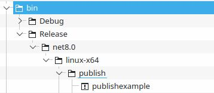

# Chapter 01 - Setup & Building Apps
This section contains first examples and shall guide you, how to build and run C# apps. All of these example are meant to be run from the command line of your favourite operating system. However you will find equivalent functionalities in most IDEs like Visual Studio or Visual Studio Code.

## Help to help yourself
Learning a new programming language is not done, by just a single introduction course, but it is something, that takes a long time. So be prepared for a long journey of learning. In order to improve your skills on your own, you can use many great resources on the internet. One of those is Mircosoft's C# language [docu](https://learn.microsoft.com/en-us/dotnet/csharp/). 

### Tasks
Run through the first tutorial that can be found [here](https://learn.microsoft.com/en-us/dotnet/csharp/tour-of-csharp/tutorials/hello-world?tutorial-step=1)

# Examples

## Hello World
No programming course can be complete without a hello world program. So here it is with C#. It is as short (and un-useful) as it can get. Just run the following commands:
```shell
    cd HelloWorld
    dotnet run 
```

### Tasks
* Run app from command line
* open app with your IDE and run it from there
* additional task:
    * use [nuget.org](nuget.org) to add package PasswordGenerator to your application
    * generate and output a password

## Publish Example
Runnin software with developer tools or from your IDE may be nice, but productive software needs to shipped. Thus it is necessary to create shippable packages. This example has no actual functionality, but will demonstrate, how you can package your solution.

As usual running the solution works like this:

```shell
    cd publishexample
    dotnet run 
```

In order to publish the solution, use the following command:
```shell
    cd publishexample
    dotnet publish publishexample.csproj  
```

If you want to create a single executable file, use the following command:
```shell
    cd publishexample
    dotnet publish -c Release --self-contained true 
    -p:PublishSingleFile=true
```
The publish command offers a lot of options and you can read more on those in the [dotnet documentation](https://learn.microsoft.com/en-us/dotnet/core/tools/dotnet-publish).

If you run this command, you'll find a single file binary of your software in the _bin_ folder. Depending on your operating system, subfolder will differ.

__Linux__



__Windows__

TODO

In this example it also worth looking into csproj file. There a custom target is defined, which will delete some generated files/folders. It serves as an example, how to add custom jobs to .Nets build system and to run them with respect to the operating system.

### Tasks
* Run app from command line
* try various publish options and find the single created file. Move this file to a different place and test, if it is running from there.
* Use your IDE's debugger and run through program step by step