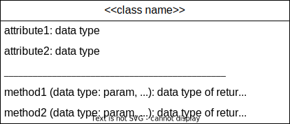
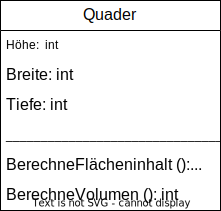
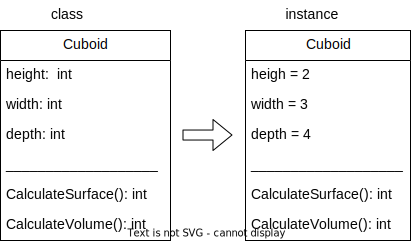

<style>
header {
  text-align: right;
  font-size: 0.7rem;
  color: #bbb;
  margin: 20px;
  left: 0px;
  right: 0px;
  padding-top: 5px;
}
footer {
  font-size: 0.9rem;
  color: #666;
}
section.lead {
  text-align: center;
  margin-bottom: 40px;
}
section.lead h2 {
  font-size: 2.5rem;
}
section {
  font-size: 1.5rem;
}

section.linked footer {
  display: none;
}
section.linked header {
  display: none;
}
section.quote {
  font-size: 0.7rem;
  text-align: center;
  font-style: italic;
  color: #555;
}

h1 {
  position: absolute;
  top: 10px;
  padding-top: 15px;
  text-transform: uppercase;
  font-size: 2.0rem;
  font-weight: 500;
  color: #2B5A6A;
}

h2 {
  font-size: 2.0rem;
  font-weight: 500;
  color: #2B5A6A;
  margin-top: 30px;
  margin-bottom: 15px;
}
a {
  color: #3A9FC1;
}
a:hover {
  color: #1E708B; 
  text-decoration: underline; 
}

</style>
<!-- _class: lead -->
## 3. Object Orientation

---
## Motivation   
* Reduzierung der Komplexität
* Verwenden einer möglichst realitätsnahen Strukturierungsmöglichkeit

---
## Ausgangsprogramm Quader
```csharp
class Program
{
    static void Main(string[] args)
    {
        //Eingabe Höhe (Kommazahl)
        Console.WriteLine("Höhe: ");
        double hoehe = Convert.ToDouble(Console.ReadLine());

        //Eingabe Breite (Kommazahl)
        Console.WriteLine("Breite: ");
        double breite = Convert.ToDouble(Console.ReadLine());

        //Eingabe Tiefe (Kommazahl)
        Console.WriteLine("Tiefe: ");
        double tiefe = Convert.ToDouble(Console.ReadLine());

        //Aufruf Metode BerechenFlaecheninhalt mit Rückgabe des Ergebnisses
        double flaecheninhalt = BerechenFlaecheninhalt(hoehe, breite, tiefe);
        Console.WriteLine("Der Flächeninhalt ist: " + flaecheninhalt);

        //AufrufMetode BerechenVolumen mit Rückgabe des Ergebnisses
        //Ausgabe Volumen
        double volume = BerechenVolumen(hoehe, breite, tiefe);
        Console.WriteLine("Das Volumen ist: " + volume);

    }

    //Definition Methode BerechenFlaecheninhalt mit Rückgabe des Ergebnisses
    static double BerechenFlaecheninhalt(double hoehe, double breite, double tiefe)
    {
        return 2* hoehe * breite + 2 * hoehe * tiefe + 2 * breite * tiefe;
    }

    //Definition Methode BerechenVolumen mit Rückgabe des Ergebnisses
    static double BerechenVolumen(double hoehe, double breite, double tiefe)
    {
        return hoehe * breite * tiefe;
    }
}
```
---
## Klassendefinition



---
## Beispiel Klasse Quader



---
## Beispiel Klasse Quader



---
## Beispiel Klasse Quader


