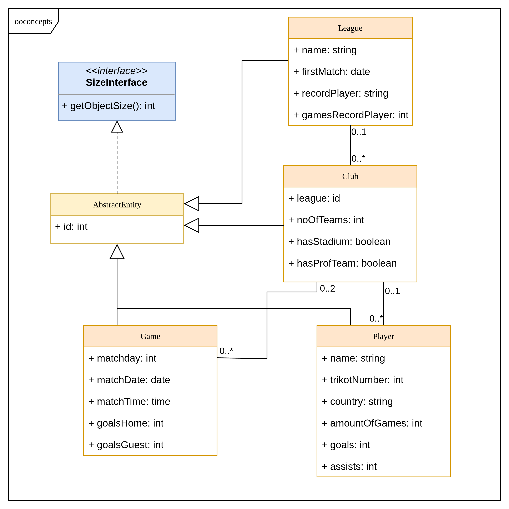
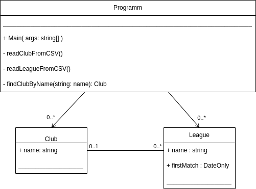

# Chapter 03 - Object oriented development
Objects and classes are the most powerful concept, to model real world ideas. As C# is an object oriented programming language, this features deserves a lot of attention. This chapter is thus will introduce the general conceptas well as the technical mechanisms provided by C#.

## Concepts
OO is based on a bunch of fundamental concepts. This subsection will introduce them (very) briefly. It is highly recommended, that you consult further literature e.g. [Wikipedia](https://en.wikipedia.org/wiki/Object-oriented_programming).

Modeling data can often be easier using graphic representations. Diagrams used in this chapter were created using [DrawIO](https://www.drawio.com/) and it is highly recommended to make yourself familiar with that tool too - it is handy in many situations.

### Classes and objects
The fundamental concept of every object oriented language is the idea of classes and objects. A class is a description of data and behaviour (== methods). So it wraps functions and data into one structure. Once this is defined, one create as many instances of this class as are necessary. Given the example below, once you have defined which data and functions are necessary to describe a sport club, you can create an object of this class for every real world club, that you want to manage.

In short, a class is:
* a blueprint of an object
* defines data (attributes/variables) and functionality (methods)

### Encapsulation
* Information & methods regarding a topic are stored inside an object
* Expose only those parts of code that are necessary
* Thus hiding all internal implementation parts
* Example: As a user, you don't need to know, how an engine works. Yet with the exposed functions (steering wheel, brakes, ...) you can perfectly use a car.

### Abstraction
* This is one of the most powerful modeling concepts in computer science
* Usually it comes in layers
* Core idea is, that underneath an exposed set of functions (aka API), a specific implementation can be exchanged, without breaking the API using code.
* Most prominent example is ISO/OSI model for networking. TCP can be used, regardless of the underlying network technology.
* This concept goes way beyond object orientation and you should study it whenever you look at successful software projects.
* __Note__ This concept makes software 

### Inheritance
* Reuse code (!)
* add small changes to a shared set of data/functions
* Looking at the car example - every car has (at least) four wheels, a number of seats, a color,... its engine can turned on/off, lights can be turned on/off. So this would be data and functions for a base class and now you can create classes for passenger cars, commercial vehicles, busses, ... Each of which extends or modify the base class.
* Software projects usually have a sophisticated hierachy of classes with inheritence. 
* A set of classes can be packed into a library such, that many development projects, use the same data structures.

### Polmorphism
* Inherit methods with the same signature, but different implementations
* In inheritence hierachies classes can not only add, but also modify bevahiour. 
* In the car example, each of the inheriting classes could its own function to model acceleration. So every class has the same functionality, it's implementation can be very different.

## On Modeling
Now it is time, to look at a real word example. Let's imagine, we want to build an app, that manages sport events. The following picture shows an example of several classes and the idea of inheritance. The notation used here is called class diagram and is part of the [unified modeling language](https://en.wikipedia.org/wiki/Unified_Modeling_Language).


Core idea here is, that a football club __is a__ sports club and thus inherits all attributes. Same goes for sailing clubs or any other kind of sports club, on could think of. All of those will have a name, a founding date and a number of members.

The next diagram shows a bunch of clases and their relations amongst each other. General idea is, that larger data structures can be broken into fitting entities like clubs, players,... and then connect them via relations. So a club for example has a number of players and is playing in a certain league.


# Examples
For the following examples we will model data for a football league. Our main domain entities will be league, club, player and game. Leagues represents a football league like the first German football leauge (Bundesliga) and clubs are the football clubs, that play in their respective league. 

The following picture shows a model subset from last subsection, that we are going to implement. It is focussing on football clubs and each of the items in this diagram will end up in a piece of code.



Every entity from the football application domain is represented by a class. As we will deal with many instances for every class e.g. there will 18 clubs for the first German football league. So we need a mechanism to tell those instances apart. For this a unique id is used and as this is necessary for all classes, attributes and logic needed are put in an AbstractEntity class from which all others will inherit.

## 01 - OO concepts
Getting a first idea how to work with classes and objects is the topic of this example. You will start to implement the classes introduced in the last subsection and play with possibilities to combine data and code.

### How to execute
On the commandline use this to run program:
```shell
    cd 01-ooconcepts
    dotnet run
```
Or use the run button in your IDE.

### Tasks
* Run program
* Create a class for League, Game and Player
* Make sure all class definitions inherit from AbstracEntity
* Create instances for every class and set fields with values of your choice
* Override getObjectSize method in every class you wrote - think of an appropriate concept, to measure size of an object.
* Look at method ToString in ClubEntity and replace base implementation with the one commented out.
* create a ToString method for every class, that outputs all fields enclosed in curly brackets

Hint: You can start with a simple version of class diagramm:



## 02 - Working with objects and relations

### How to execute
On the commandline use this to run program:
```shell
    cd 02-relations
    dotnet run
```

### Tasks
* Copy your class definition from last chapter
* Create three objects for each league/club/player/game class fill all fields
* For every class create an array and put your instances into that array, note setting proper ids
* Create a method that outputs all instances content in each array.
* Why are arrays a very bad idea?
* The id field in every class allows you to implement relations from UML diagram - write a method, that takes a LeagueEntity + an array of ClubEntites and outputs all clubs playing in given league.
* Ids are a pretty complicated way, to do this - any idea, what else is possible?
* Consider following code:
  ```C#
    internal class ClubEntity: AbstractEntity
    {
        LeagueEntity myLeague;

        public LeagueEntity MyLeague
        {
            get {return myLeague;}
            set {myLeague = value;}
        }
  ```
  Replace all single relations, with a reference to an actual object. Adapt data setup section in constructor.

## Lists & Generics
In chapter 2 arrays were introduced and with those, one can create collections of all sorts of types. However arrays have serious limits, most of all one has to specify their size. Wouldn't it be great to have a data structure, that let's you add as many elements as necessar? C# offers indeed a lot of more sophisticated data structures know as [collections](https://learn.microsoft.com/en-us/dotnet/standard/collections/). 

In this example we will look into lists and learn how to use them. Before we jump into the example's code, let's consider the following aspect. With arrays one needs to specify what kind of objects are stored in that particular array. As a reminder this is defines an array that can hold ten strings:
```C#
string[] emptyArray = new string[10];
```

Now a list of objects ist constructed by adding a reference to the next element. If you want to build a list from scratch, you would take e.g. the ClubEntity and add a ClubEntity reference to its fields. Of course you would need a lot functionality like adding/removing elements and writing this kind of code is boring - Generics to the rescue.

The next code snippet shows you a list definition and in brackets you can specifiy the type of element stored in the list. And with that you are all set. This is called a generic data type and is based on the idea, that one can implement a great many functions, without knowing the exact structure of a class.
```C#
List<ClubEntity> clubs = new List<ClubEntity>();
```
Obviously this is a very broad topic and thus you are encouraged to read more. [Microsoft's documentation](https://learn.microsoft.com/en-us/dotnet/standard/collections/) is a good starting point.

### How to execute
On the commandline use this to run program:
```shell
    cd 03-lists
    dotnet run
```

### Tasks
* Run program
* Copy all class definitions from last project and create a list for each of them. Output contents of every list.
* In the last section, we learned how to use actual object references instead of ids to implement relations of classes. Now add a list of clubs to the LeagueEntity. Put all clubs playing in a league into the LeagueEntity list.
* Write a function, that takes a new ClubEntity and adds it to the list of all clubs and the list of clubs of the according LeagueEntity. Based on the league id in the club object, set the reference to the fitting LeagueEntity.
* Implement the relations for all classes from the example's UML diagram.
* Write a function, that takes a string as input and searches for all clubs with a name, starting with the input string.
* Write a function, that takes a string as input and searches for all clubs with a name, containg the input string.
* Look into the [sort documentation](https://learn.microsoft.com/en-us/dotnet/api/system.collections.generic.list-1.sort?view=net-8.0) and try to sort one of the lists created in this excercise.
* Bonus challenge: Add [IComparable](https://learn.microsoft.com/en-us/dotnet/api/system.icomparable?view=net-8.0&redirectedfrom=MSDN) interface to AbstractEntity and implement Compare function in every entity class.

## More data structures
While lists are super useful, they can't solve all problems. So C# offers plenty of build in data structures. This example shows just some of them and you can find an overview [here](https://learn.microsoft.com/en-us/dotnet/api/system.collections.generic?view=net-8.0).

__Dictionaries__

Consider a list of league champions for every year. So you need a structure, that can save a ClubEntity for every year. For use cases like this Dictionaries can be used. Make sure to have a look into the [documentation](https://learn.microsoft.com/en-us/dotnet/api/system.collections.generic.dictionary-2?view=net-8.0).

### How to execute
On the commandline use this to run program:
```shell
    cd 04-more-datastructures
    dotnet run
```

### Tasks
* Run program
* Extract outputing ClubDictionary to a private method
* Copy player entity from previous example and create a dictionary mostValuablePlayer<int, PlayerEntity>. Add a player for a number of years.
* Notice that dictionaries are not sorted, however there is a method to sort by key. See [this site](https://www.c-sharpcorner.com/article/how-to-sort-a-dictionary-with-c-sharp/) for an example. Bonus challenge sort champion dictionary by year.