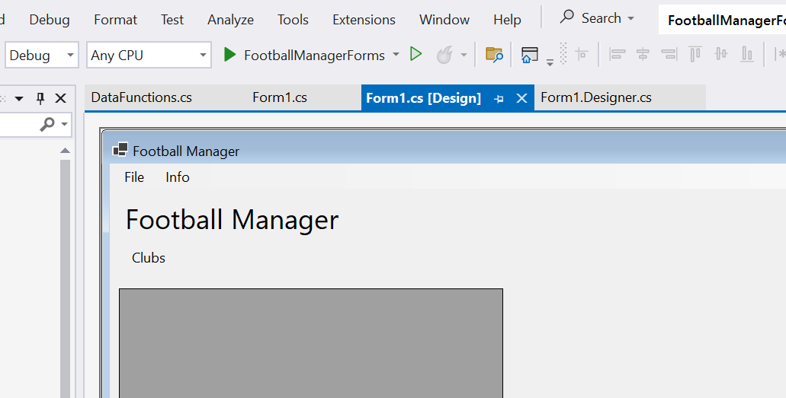
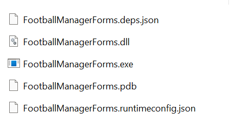

# Chapter 06 - Real World Examples
C# and the .Net runtime can be used to build a large variety of software types. If you made it to this section, you are already familiar with C# as a programming language. So here is a set of examples that shows you which kind of applications, you can build. Note that this list is by no means complete. 

# Examples

## Windows Forms - Football Manager
Windows Forms is a framework with which you can build applications for Microsoft Windows. It is already quite dated, but still widely used. So this section contains an example for how to build the Football Manager example with Windows Forms. Needless to say - this will not work on Linux.

Example already loads the data for ClubEntities and display them in a data grid view.

### How to execute
You can run Application from Visual Studio by opening Form1.cs and hit run button.


As an alternative app can also run by double clicking on resulting binary.


### Tasks
* Run program
* Find binary in explorer
* Load the three other CSV files and show their content in a data grid view.
* Hide dataGridView until data is loaded
* Bonus Challenge: Use a [file selection dialog](https://learn.microsoft.com/en-us/dotnet/desktop/winforms/controls/how-to-open-files-using-the-openfiledialog-component?view=netframeworkdesktop-4.8) for selecting CVS file.

## Windows Presentation Foundation (WPF)
With Windows Forms' serious shortcomings in layout and supporting high resolution displays WPF was developed. It is a combination of XML and C# to separate layout/style from application logic. If you have ever build web application, that may sound familiar. If you want to know more, [Wikipedia](https://en.wikipedia.org/wiki/Windows_Presentation_Foundation) is a good starting point.

### How to execute
You can use Visual Studio to run app, or find compiled executable in file explorer.

### Tasks
* Run program
* Load the three other CSV files and show their content in a [data grid](https://learn.microsoft.com/de-de/dotnet/desktop/wpf/controls/datagrid?view=netframeworkdesktop-4.8).
* Hide dataGrid until data is loaded
* Bonus Challenge: Use a [file select dialog](https://learn.microsoft.com/de-de/dotnet/desktop/wpf/windows/how-to-open-common-system-dialog-box?view=netdesktop-8.0) to open CSV files. 

## Worker Tasks
Quite often it is necessary to run a job on a fixed time interval and do things in the background. C# provides a project template for that as well.

### How to execute
On the commandline use this to run program:
```shell
    cd backgroundjob
    dotnet run
```

### Tasks
* Run program and observe output
* Create an INI file with a key _execution-intervall_. Load this INI file and use configured value for execution intervall.
* Create a second key _search-path_ which holds a file system location. Change program such, that it lists all files in this directory.
* Bonus Challenge: List all changes in file list.

## ASP.Net - Web Applications

### Create a simple WebApp
You can create a webapp easily by using `dotnet new webapp` command. That was already done for the code in the directory `FootballManagerWeb`. You can start the WebApp as usual with `dotnet run` and you will find the url to access the app via browser in the console output. 

You can find a [Quickstart](https://learn.microsoft.com/de-de/aspnet/core/getting-started/?view=aspnetcore-8.0) and more a [detailed description](https://learn.microsoft.com/de-de/aspnet/core/tutorials/razor-pages/razor-pages-start?view=aspnetcore-8.0&tabs=visual-studio-code) on microsoft pages.

### How to execute
On the commandline use this to run program:
```shell
    cd FootballManagerWeb
    dotnet run
```
Or use the run button in your IDE.

### Tasks
* Run program and open it in Browser
* Go to directory `Pages` and inspect the existing code. Go to [tutorial](https://learn.microsoft.com/de-de/aspnet/core/tutorials/razor-pages/razor-pages-start?view=aspnetcore-8.0&tabs=visual-studio-code) and find out, what the different files are for
* change something in file `Pages\Index.cshtml` and see result in browser
* In the top-menu of the app you can see menu item `Clubs`. Here you can write Clubs to sqllite - an in-memory database. See [this tutorial](https://learn.microsoft.com/de-de/aspnet/core/tutorials/razor-pages/model?view=aspnetcore-8.0&tabs=visual-studio-code) and find out, how Clubs are written to database.
* add leage to the app and write it to database similiar to clubs.

For informations about sqllite, see [here](https://jasonwatmore.com/post/2022/09/05/net-6-connect-to-sqlite-database-with-entity-framework-core)

## Maui Apps
Building applications with a graphical interface is usually platform / os dependent. Maui is a framework, with which you can build os independent applications.

for maui get dotnet 8.0.4xx:
* download dotnet from here: https://dotnet.microsoft.com/en-us/download/dotnet/8.0
* extract package:
    ```sh
    mkdir -p $HOME/dotnet && tar zxf dotnet-sdk-8.0.401-linux-x64.tar.gz -C $HOME/dotnet
    export DOTNET_ROOT=$HOME/dotnet
    export PATH=$PATH:$HOME/dotnet
    ```
* see tutorial here: https://techcommunity.microsoft.com/t5/educator-developer-blog/net-maui-on-linux-with-visual-studio-code/ba-p/3982195


